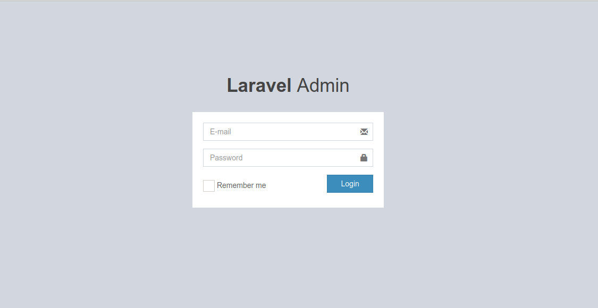
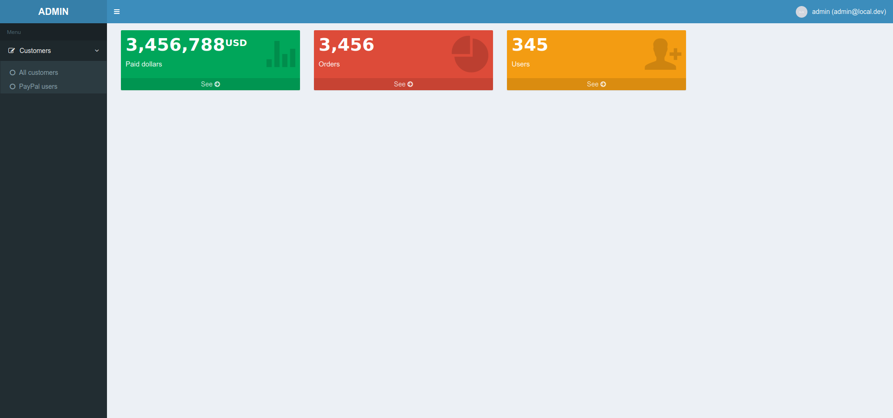

# Laravel Admin

This is a convenient project that mixes Laravel, AdminLTE2, and spatie-permissions.

### Install

```
git clone git@github.com:egorsmkv/laravel-admin.git
cd laravel-admin
composer install
npm install
npm run dev
php artisan app:create-roles
php artisan app:create-admin admin@local.dev
php artisan serve
```

### Screenshots




